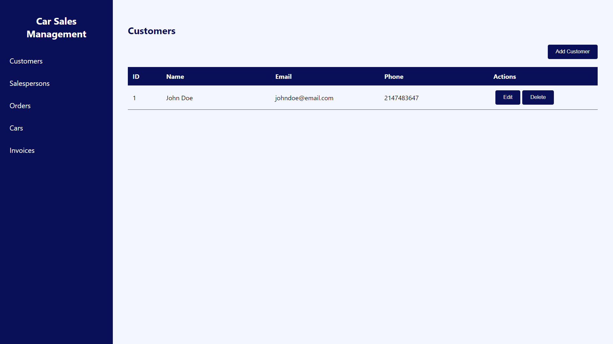
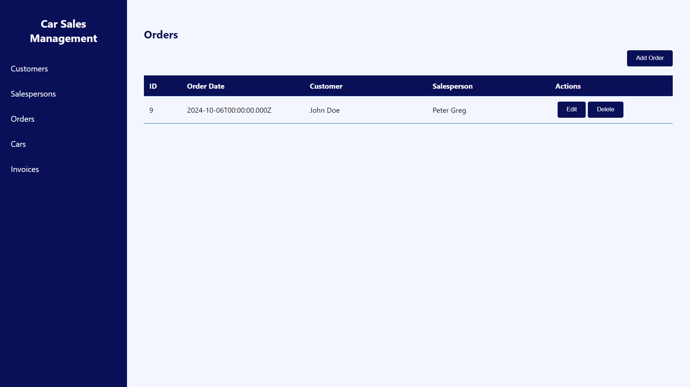

# Car Sales Management System

Ini adalah **Sistem Manajemen Penjualan Mobil** yang dibangun dengan **React.js** untuk front-end dan **Express.js** dengan **Sequelize** untuk back-end. Sistem ini memungkinkan pengelolaan pelanggan, tenaga penjualan, pesanan, mobil, dan faktur, dengan operasi CRUD lengkap untuk masing-masing.

## Features

- **Customers**: Manage customer information (name, email, phone).
- **Salespersons**: Manage sales staff information.
- **Orders**: Manage sales orders and their associated details.
- **Cars**: Manage car inventory.
- **Invoices**: Manage invoices tied to orders.

## Technologies

### Frontend
- **React.js**: For the front-end user interface.
- **Axios**: For making HTTP requests to the back-end API.
- **React Router**: For routing between different pages.
- **CSS**: For styling the components.

### Backend
- **Node.js**: For running the back-end server.
- **Express.js**: For creating RESTful APIs.
- **Sequelize**: For database management and ORM.
- **MySQL**: As the database.

## Installation

### Prerequisites

- **Node.js** and **npm** installed on your machine.
- **MySQL** installed and running.

### images
<div align="center">
  
</div> <br>
<div align="center">
  
</div> <br>

### Backend Setup

1. Clone the repository:

   ```bash
   git clone https://github.com/alimw15/uts_alimwijaya_fe.git
   cd uts_alimwijaya_fe
